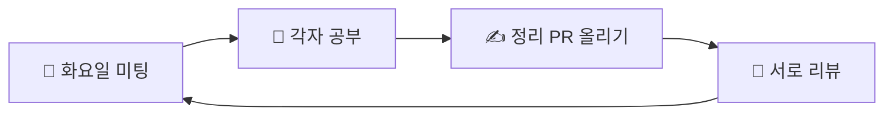
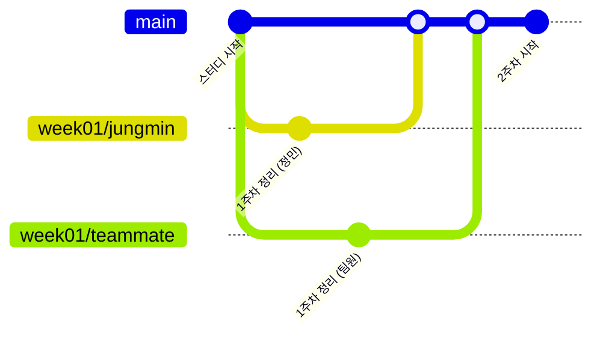

<div align="center">

# 🌿 Git Study

**둘이서 천천히, 꾸준히 Git과 친해지는 스터디**

[](https://git-scm.com/book/ko/v2)
[](https://learngitbranching.js.org/?locale=ko)
[](#-진행-방식)

</div>

---

## 👥 멤버

<table align="center">
  <tr>
    <td align="center">
      <a href="https://github.com/GITHUB_ID_1">
        <br>
        <b>조정민</b>
      </a>
    </td>
    <td align="center">
      <a href="https://github.com/GITHUB_ID_2">
        <br>
        <b>팀원 이름</b>
      </a>
    </td>
  </tr>
</table>

---

## 🔄 진행 방식



| 언제 | 무엇을 |
|:---:|---|
| 📅 **화요일** | 온라인 미팅 · 질문 나누기 · Learn Git Branching 같이 풀기 · PR 머지 |
| 📖 **평일** | Pro Git 읽고 Learn Git Branching 풀기 |
| ✍️ **미팅 전까지** | 공부한 내용을 정리해서 PR 올리기 |
| 💬 **틈틈이** | 서로의 PR에 리뷰 남기기 (못 했으면 미팅 때 같이!) |

> [!NOTE]
> 바쁜 주엔 분량을 줄이거나 쉬어도 괜찮아요. 미팅에서 한마디만 해주세요 🙂

---

## 🌳 작업 흐름

`main`에는 직접 push하지 않고, 항상 **브랜치 → PR → 리뷰 → 머지** 순서로 진행해요.



| 구분 | 규칙 | 예시 |
|---|---|---|
| 🌿 브랜치 | `week주차/이름` | `week01/jungmin` |
| 💾 커밋 | `docs: 내용` | `docs: 1주차 정리 추가` |
| 📂 정리 파일 | `weeks/week주차/이름.md` | `weeks/week01/jungmin.md` |

---

## 🧭 진도

날짜 대신 순서대로, 할 수 있는 만큼 진행해요. 완료하면 체크! ✅

- [ ] **0. 킥오프** — 환경 세팅 + 첫 PR
- [ ] **1. 기초** — Pro Git 1~2장 · LGB 기초편 1~2
- [ ] **2. 브랜치** — Pro Git 3장 · LGB 기초편 3~4, 위로 올라가기 1~3
- [ ] **3. 협업** — Pro Git 5장, 6장 앞부분 · LGB 원격 탭
- [ ] **4. 실전** — Pro Git 7장 일부 (stash, reset 등) · LGB 위로 올라가기 4, 이동시키기
- [ ] **5. 마무리** — 팀 컨벤션 정리 + 회고

---

## ✅ 우리의 룰

- 💬 리뷰할 땐 **좋았던 점 1개 + 질문 1개** 남기기
- 🙋 모르는 건 부끄러운 게 아니에요. 막히면 바로 질문하기
- 🚫 `main`에 직접 push 금지
- 📖 새로 알게 된 용어는 [`glossary.md`](./glossary.md)에 같이 모아요

> [!TIP]
> **책은 2014년판이라 이렇게 바꿔 읽어요**
> - `master` → `main`
> - `git checkout` → 브랜치 이동은 `git switch`, 파일 되돌리기는 `git restore`

---

## 📁 폴더 구조

```
git-study/
├── README.md
├── glossary.md                      # 공용 용어집
├── .github/
│   └── pull_request_template.md     # PR 템플릿
└── weeks/
    ├── week01/
    │   ├── jungmin.md
    │   └── teammate.md
    └── week02/
        └── ...
```

---

<details>
<summary><b>🆘 자주 쓰는 명령어 모음 (펼치기)</b></summary>

```bash
# 최신 main 받아오기
git switch main
git pull

# 이번 주 브랜치 만들기
git switch -c week01/이름

# 정리하고 저장하기
git add .
git commit -m "docs: 1주차 정리 추가"

# 올리기
git push -u origin week01/이름

# 지금 상태 그림으로 보기
git log --oneline --graph --all
```

</details>

<div align="center">

**천천히, 그래도 꾸준히 🌱**

</div>
