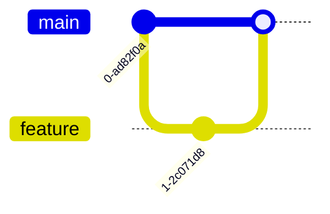

# 📝 마크다운 가이드

> [!TIP]
> VS Code에서 `Ctrl + Shift + V` 누르면 미리보기가 보여요!

## ✍️ 정리 파일 틀

`weeks/week02/soonjun.md` 처럼 **주차는 두 자리, 이름은 영어 소문자**로 만들고, 아래를 복사해서 시작하세요.

````markdown
# X주차 정리 - soonjun

> 📖 범위: Pro Git 2.4~2.8 / Learn Git Branching 기초편 2

## 📌 핵심 내용

## 💻 직접 해본 명령어

## 💡 새로 알게 된 것

## ❓ 헷갈리는 점 / 질문
````

책을 옮겨 적기보다 **내 말로 3~5줄**이면 충분해요. 질문 칸은 비워두지 않기!

---

## 🔤 자주 쓰는 문법

| 이렇게 쓰면 | 이렇게 보여요 |
|---|---|
| `# 제목` | 큰 제목 (`#` 뒤 띄어쓰기 필수!) |
| `## 소제목` | 섹션 제목 |
| `**굵게**` | **굵게** |
| `` `git status` `` | `git status` |
| `- 항목` | • 목록 |
| `1. 항목` | 1. 번호 목록 |
| `> 인용` | 인용 박스 |
| `[글자](주소)` | 링크 |
| `- [ ] 할 일` | 체크박스 |

명령어, 파일 이름, 브랜치 이름은 백틱(`` ` ``)으로 감싸요. 키보드 `~` 키에 있어요.

---

## 💻 코드 블록

백틱 3개로 감싸고 언어 이름을 적으면 색이 입혀져요.

````markdown
```bash
git add .
git commit -m "docs: 정리 추가"
```
````

---

## 📊 표

```markdown
| 명령어 | 하는 일 |
|---|---|
| `git add` | 스테이징 |
```

---

## ✨ 있으면 좋은 것들

**강조 박스**
```markdown
> [!NOTE]
> 참고할 내용
```

**브랜치 그림** (공부한 내용 정리할 때 추천!)
````markdown

````

**이미지**: GitHub 웹 편집 화면에 캡처를 드래그하면 주소가 자동으로 만들어져요.
